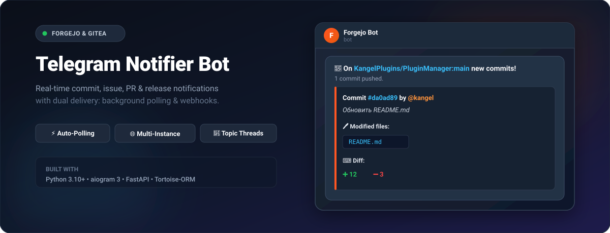
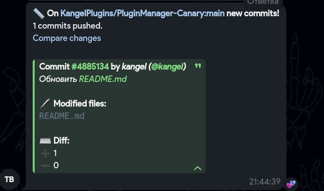
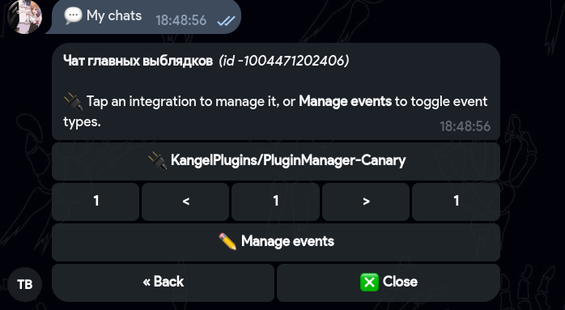
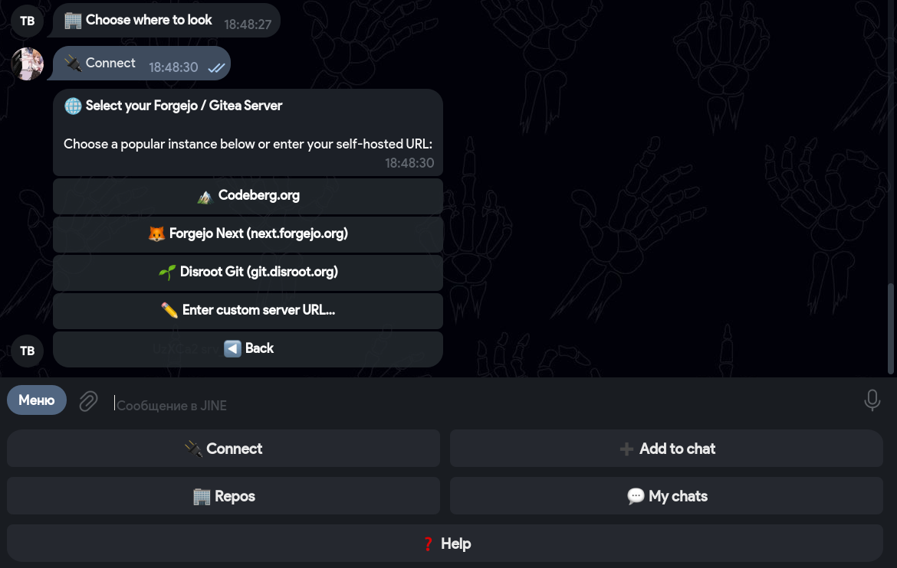

# forgejo-notifi-bot



Telegram bot that delivers real-time notifications about your **Forgejo** and **Gitea** repositories
(commits, pull requests, issues, releases, stars, forks and more) to
group chats — through background polling and webhooks. Works out of the box with any instance
(Codeberg, Forgejo Next, Disroot, or self-hosted). Written in Python on top of aiogram 3 + aiogram-dialog,
FastAPI, and Tortoise-ORM.

## Screenshots







## Features

- 🔔 **Real-time notifications** for Forgejo event types (see the table below) delivered as Telegram-HTML messages.
- ⚡ **Background Polling** — works locally on any machine without needing a public IP, port forwarding, or tunnels.
- 🌐 **Multi-Instance support** — connect to Codeberg.org, Forgejo Community, Disroot, or any self-hosted Forgejo/Gitea instance with a custom URL.
- 🔑 **Personal Access Token auth** — granular and secure token-based authentication verified against `/api/v1/user`. Auto-deletes token messages in DM for safety.
- 💬 **DM-first UX with aiogram-dialog** — persistent reply keyboard (`🔌 Connect`, `🏢 Repos`, `💬 My chats`, `➕ Add to chat`, `❓ Help`) plus three multi-window dialogs (server & token, repos browser, my-chats browser) with typed Pydantic-backed dialog state.
- 🏢 **Repos browser** — paginated list of accounts/orgs, drill into repos, "Integrate to a chat…" picker that verifies admin rights and creates the integration. No copy-pasting commands.
- 💬 **My chats** — see all chats where you have integrations, manage each integration (delete, view server URL) and toggle event types **without leaving DM**.
- 🧰 **Per-chat event toggles** via `/events` — enable/disable each event type independently. Same UI also accessible from `/integrations` and from the My-chats DM dialog.
- 🔄 **`/reinstall`** — re-syncs the webhook subscription list with the bot's current capabilities.
- 🧵 **Forum topic delivery** — `/set_topic` records the active forum topic and notifications are routed there. Falls back to General if the topic is closed.
- 👥 **Admin-gated everywhere** — only chat administrators can integrate, delete, set topic, change events or reinstall (re-checked at action time).
- 🛡 **Structured error handling** — distinct user-friendly messages for invalid/expired token, missing scopes, no admin access, repo not found, etc.
- ⚠️ **Delivery-failure DM** — when the bot can't deliver to a chat (kicked, chat deleted, etc.) the integration owner gets a DM with the cause. Rate-limited per `(user, chat)` to 30 minutes.
- 🌟 **Star anti-flood** — per-chat configurable cooldown so a viral repo doesn't spam the chat.
- 📦 **Pluggable event architecture** — each event type lives in `app/events/` as a single file with a Pydantic schema and a formatter, and self-registers on import.
- 🔌 **Dual delivery mode** — supports both direct background polling and incoming webhooks (`/webhook/{token}`).

## Supported events

| Event | What triggers it | Notes |
|-------|------------------|-------|
| `ping` | Webhook installation | Auto-fired once on hook creation |
| `push` | Commits pushed to a branch | Per-commit file diff stats (`➕/➖`) and commit author profile links |
| `issues` | Issue lifecycle | Filtered to `opened`, `closed`, `reopened`, `assigned` |
| `issue_comment` | Comments on issues and PRs | Filtered to `created`; PR comments are labelled accordingly |
| `pull_request` | PR lifecycle | Filtered to `opened`, `closed`, `reopened`, `ready_for_review`; "merged" rendered with 🟣 |
| `pull_request_review` | Review submitted on a PR | Filtered to `submitted`; icon by review state (✅/🔴/💬/⚪) |
| `pull_request_review_comment` | Inline comment on a PR diff | Filtered to `created`; shows file path |
| `commit_comment` | Comment on a specific commit | Filtered to `created` |
| `star` | Repo starred / unstarred | Anti-flood applies per chat |
| `fork` | Repo forked | Shows total forks count |
| `create` | Branch or tag created | |
| `delete` | Branch or tag deleted | |
| `release` | Release created/published | Filtered to `published`; drafts skipped; prerelease label shown |

## Project layout

```
app/
├── __main__.py                  # entry point (bot polling + background poller + webhook server)
├── arguments.py                 # CLI args
├── commands.py                  # Telegram bot command menu
├── config.py                    # Pydantic-validated TOML config
│
├── db/
│   ├── models.py                # Tortoise models + EventType
│   │                            # (User, Chat, Integration, Eventsetting)
│   └── functions.py             # Query helpers / domain methods
│
├── events/                      # One file per event: Pydantic schema + formatter
│   ├── _base.py                 # Shared nested schemas (User, Repo, Issue, …)
│   ├── _context.py              # EventCtx dataclass
│   ├── _formatting.py           # HTML helpers (truncate, links, escape)
│   ├── _registry.py             # Event registry + build_message()
│   ├── push.py                  # — per-event modules —
│   ├── pull_request.py
│   ├── issues.py
│   └── …
│
├── handlers/
│   ├── admin/                   # /error, /mailing — owner-only
│   └── user/
│       ├── start.py             # /start, /help
│       ├── dm_menu.py           # Reply-keyboard taps in DM
│       ├── token.py             # /token, /connect dialog launcher
│       ├── integration.py       # /integrate, /integrations, /delete, /set_topic
│       ├── reinstall.py         # /reinstall
│       ├── event_settings.py    # /events keyboard + settings
│       └── text.py              # Free-form DM text dispatcher (repo lookup)
│
├── dialogs/                     # aiogram-dialog flows
│   ├── token.py                 # TokenSG: server picker / custom URL / token entry
│   ├── repos/                   # ReposSG: orgs → repos → integrate to chat
│   └── my_chats/                # MyChatsSG: manage active chat integrations
│
├── keyboards/
│   ├── main_menu.py             # Persistent reply keyboard (DM)
│   └── integration.py           # Inline keyboards for /integrations + management
│
├── middlewares/
│   └── throttling.py            # Per-chat rate limiting
│
├── services/
│   ├── integration.py           # integrate_repo logic
│   └── poller.py                # Background polling service for commits, issues, releases
│
├── utils/
│   ├── aiogram_helpers.py       # accessible_message, safe_edit_text/_markup
│   ├── chat_access.py           # resolve_chat_title, list_admin_chats
│   ├── dialog_helpers.py        # current_user_for_manager
│   ├── dialog_state.py          # DialogState base class
│   ├── filters.py               # IS_DM, IS_GROUP_LIKE Magic-filter constants
│   ├── forgejo.py               # Forgejo/Gitea REST API client + webhook helper
│   └── group_admin.py           # get_admin_ids, is_user_admin
│
└── webhook/                     # FastAPI side
    ├── api.py                   # POST /webhook/{token} — incoming webhook handler
    └── main.py                  # uvicorn entry point
```

## Quick Start

1. **Install dependencies:**
   ```bash
   pip install -r requirements.txt
   ```

2. **Configure the bot:**
   ```bash
   cp example.toml config.toml
   ```
   Edit `config.toml` and fill in your Telegram bot token (`token`) and owner ID (`owner_id`).

3. **Start the bot:**
   ```bash
   python -m app
   ```

4. **Connect in Telegram:**
   - In DM with the bot, tap **🔌 Connect** (or `/connect`).
   - Pick your instance (Codeberg, Forgejo Next, Disroot, or enter custom URL).
   - Send your Personal Access Token.
   - Add the bot to your group/channel as an admin and use `/integrate owner/repo` or the **🏢 Repos** button!

## Commands

| Command | Location | Description |
|---------|----------|-------------|
| `/start` | DM | Open main menu & registration |
| `/connect` | DM | Connect Forgejo server & Access Token |
| `/token` | DM | Manage server connection & token |
| `/integrate owner/repo` | Group | Bind a repository to the current chat |
| `/integrations` | Group | View and manage active integrations |
| `/events` | Group | Toggle event notifications on/off |
| `/set_topic` | Group Topic | Route alerts to the current forum topic |
| `/delete owner/repo` | Group | Remove an integrated repository |
| `/reinstall` | Group | Re-sync subscriptions with Forgejo API |
